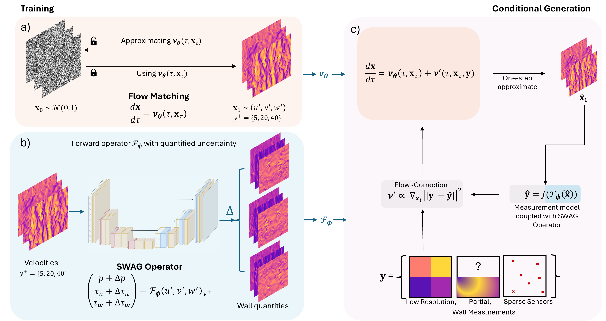

# Conditional Flow Matching for Generative Modelling of Near-Wall Turbulence

This repository contains the official implementation of the paper: **"Conditional flow matching for generative modelling of near-wall turbulence with quantified uncertainty"**.

[**Read the paper**](https://doi.org/10.1017/jfm.2026.11193)

## Methodology



## Environment Setup

To set up the environment, follow these steps:

1.  **Create the Conda environment:**
    ```bash
    conda env create -f environment.yml
    ```

2.  **Activate the environment:**
    ```bash
    conda activate fm-swag-flowreconstruct
    ```

3.  **Configure Environment Variables:**
    Create a `.env` file in the root directory of the repository with the following content. Specify the GPU device ID you wish to use (leave empty if not applicable or to use default).

    ```bash
    CUDA_VISIBLE_DEVICES=
    PYTHONPATH=$PYTHONPATH:.
    ```

    Then, source the environment file using the following command:
    ```bash
    set -o allexport && source .env && set +o allexport
    ```

## Usage

Run scripts using the following syntax:
```bash
python scripts/<script_name>.py scripts/<config>.yaml
```

### Training

-   **Flow Matching Model:**
    For training the flow matching model to learn the prior distribution of velocity fluctuations:
    ```bash
    python scripts/training/train_unet_fm.py scripts/training/unet_fm.yaml
    ```

-   **Baseline (FCN):**
    For the baseline training, you can use either the Wall-Measurement $\rightarrow$ Velocity-Fluctuations (WMVF) or Velocity-Fluctuations $\rightarrow$ Wall-Measurement (VFWM) configuration.
    ```bash
    python scripts/training/train_unet_baseline_fwd_op.py scripts/training/unet_bb_wmvf.yaml
    # OR
    python scripts/training/train_unet_baseline_fwd_op.py scripts/training/unet_bb_vfwm.yaml
    ```

-   **SWAG Model:**
For training SWAG forward operator, used for conditional inference:
    ```bash
    python scripts/training/train_unet_swag_fwd_op.py scripts/training/unet_swag_fwd_op.yaml
    ```

### Inference

-   **Conditional Inference:**
    ```bash
    python scripts/inference/ours_prod.py scripts/inference/ours.yml
    ```

-   **Unconditional Inference:**
    ```bash
    python scripts/inference/ours_uncond_prod.py scripts/inference/ours_uncond.yml
    ```

-   **Baseline Inference:**
    ```bash
    python scripts/inference/baseline_prod.py scripts/inference/baseline.yml
    ```

## Issues

Please open an [issue](https://github.com/jx-wang-s-group/FM-SWAG-FlowReconstruct/issues) if you have any questions.

## Citation

If you find this code useful in your research, please cite:

```bibtex
@article{Parikh_Fan_Wang_2026,
 title={Conditional flow matching for generative modelling of near-wall turbulence with quantified uncertainty},
 volume={1029},
 DOI={10.1017/jfm.2026.11193},
 journal={Journal of Fluid Mechanics},
 author={Parikh, Meet Hemant and Fan, Xiantao and Wang, Jian-Xun},
 year={2026},
 pages={A32}
}
```
